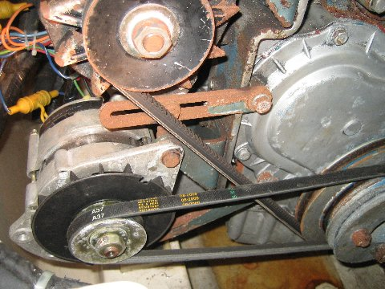

# bilgeAlarm - History

**[Home](readme.md)** --
**History** --
**[Previous](previous.md)** --
**[Design](design.md)** --
**[Hardware](hardware.md)** --
**[Software](software.md)** --
**[UI](user_interface.md)**

Even today, nearly 14 years after the incident, it is a bit difficult for me to
publicly acknowledge that I nearly **sank my boat** one day.  But it may be
*interesting* and *educational* for others to read about the event, and it explains the **motivation**
behind this series of projects that I subsequently undertook to try to prevent
it from occurring again.

### Planning a trip from Bocas to Cartagena

In 2009 I was walking the docks of the marina when a friend said that there were
three young women looking to charter a boat to go from **Bocas Del Toro** to
**Cartagena, Colombia**.  At that time [**Rhapsody**](http://www.phorton.com/html/Rhapsody.html)
was in nearly perfect *ready-to-go* shape, I was *completely single* and a bit *bored*,
and it seemed like it might be **fun** to take a sailing trip to a *new country*.

I met with the girls and tentatively agreed to take them to Colombia, stopping
for a few weeks in the beautiful **San Blas Islands** of Panama along the way.  I didn't want
to make the trip alone, as none of them had any sailing experience, so I asked my best
friend **Andy Crawford** if he would like to go too.  He said yes, and elected to bring
his girlfriend at that time, **Camilla**, along for the trip.

**Andy at the helm of Rhapsody**

### Preparation (Immigration, Customs, Etc)

We did a few sails around the bays and waters of **Bocas** to familiarize everyone
with the boat.   As **captain** I was responsible for ensuring not only everyone's
safety, but also for dealing with all the legal aspects of taking passengers on the
boat through international waters to another country.

We made plans for the trip including what **provisions** we would need, sleeping
arrangements, watch schedules, and so on.  Inasmuch as Andy and I were the only
experienced sailors we decided that one of the two of us would always be awake
and on watch.

We had planned to leave Bocas about 2pm, so-as to cross the busy
**Panama Canal** shipping channel the next morning, during daylight, but
as it turned out, there were issues with getting all of the paperwork done
for immigration and customs, and clearing out of the port of Bocas
that day, so we did not get under way until about 10:00pm that night.

### Leaving Bocas

We had started the day early, and I was to take the dog watch, from 2am until
6am, and was supposed to sleep from 10pm until 2am, but due to the late departure,
and the excitement of the day, I didn't get any sleep before my watch.

We motored out of Bocas then put up the sails.   It was a bit windy (15-20 knots),
but the wind was generally on our beam, and the current and seas were following,
so we had a very nice, though exciting initial sail.   We were making almost 10 knots
over ground (with the 2 knot current) and Rhapsody was crashing through wave
after wave with quite a bit of motion.

**Rhapsody under Sail**

At that rate we would cover the 140 miles to the Panama Canal in about 14-16 hours, and
would thus cross the shipping lanes, as planned, during daylight.

At 2am, I took the helm and Andy and the girls went below to sleep.  I stayed up talking with
Camilla as we banged through wave after wave.  It was a bit raucous, but majestic, as Rhapsody
put her nose into each wave, sending 1-2" of green water over the deck on each wave, sending
spray into the air.

A few minutes before 6am I went below and woke Andy so that he could take his watch.
I was pretty tired, having been up 24 hours by then, and looking forward to my 4 hours
of sleep.  Andy came up, I gave him the helm, and retired to the starboard aft cabin.

### Little Surfers

I had just fallen asleep, I think, when I was awakened by Andy pounding on the door
to the cabin shouting **"Patrick, wake up, we're taking on water!!"**.   It was around
7:00 am.

I came out of the cabin, groggy, and could not quite make out what I was seeing.
Still half asleep, **the floor boards in the salon were floating, sloshing back
and forth** and for some reason I remember thinking "wow, it's like little
surfers are surfing little waves* as my brain struggled to make sense of the sight.

Now, in order to grasp the severity of the situation, you have to first understand that in
Rhapsody, a Beneteau 510, the bilge is about 3 feet deep under the floor.  She is 51 feet
long, so that meant there were **1000** or more gallons of water in the boat already!!

I mean ... **the**  ... **floor boards** ... **were** ... **floating** ...

The first thing that came to my mind was to get on the **VHF Radio** and let someone
know about our predicament.   So I got on the radio, which fortunately was still working.

**"Pan Pan ... this is Sailing Vessel Rhapsody, we are taking on water and are located at
xxxx xxxx longitude and latitude !!! !!! !!!"**.

I will admit I was a little panicky.   I had just woken up, had no idea where we were,
and I think it came through in my voice over the radio as I repeated the message.

As I was radioing, Andy woke the girls, got some buckets, and started them to bailing
water by passing the buckets from the salon up the companion way and dumping them into
the cockpit where the water could run out.

I repeated the **Pan** distress call:
**"Pan Pan ... this is Sailing Vessel Rhapsody, we are taking on water and are located at
xxxx xxxx longitude and latitude.  Is anybody there???, Please come back!!"** as I looked at the chart plotter
and noticed where we were for the first time.

A voice came back on the Radio **"Patrick, calm down! this is Jan from MV Emma Jo"**.

### Big Sigh of Relief

**Jan and Ole** were good friends from Bocas who had since moved their boat **Emma Jo**
to **Linton**, the next bay past the Panama Canal on the way to the San Blas, so it
was a huge relief not only to have made contact with someone, but to have made contact
with someone I knew.

I told Jan that we were taking on water, and that we had no idea where it was coming from,
however by then I knew we were only about 10 miles offshore, near the port of **Linton, Panama**.

Jan told me to check it out, and get back to her, and if necessary, her husband **Ole** would come out
in a motor boat and pick us up.

*I did not get ANY photographs of the event itself, or of the subsequent struggles to get the
boat running and get to Cartagena.  We were too busy!*

### Stop the motor!

So, as the girls continued to do the **bucket brigade** (reminding me of the saying that
"there is no more effective bilge pump than a scared sailor with a bucket") Andy and I
attempted to determine where the water was coming from.

**We opened the engine compartment and were greeted by water gushing about**.
**The engine was nearly completely under water**. A bit more
description is necessary here.

**The motor**

At some point during the evening the winds had died down a bit and we had
started *motor sailing*; that is we both had the **sails up** AND the **motor running**.

**The motor was still running, though it was 90% under water**.   In fact the
water was only an inch or so below the motor's **air intake** at which point
the cylinders would have filled with salt water, and the motor would have stopped.
But it was still running.   And still pumping saltwater through the cooling system.
**Both alternators were still turning, under water**.  This caused quite a bit
of *splashing*.   Plus the boat was still moving quite a bit through the seas,
rocking back and forth as well as from front to back through 10's of degrees.

Our first thought was that an inlet or outlet hose on the motor cooling system
had broken, so we made the decision to **turn off the motor** which turned out
to be a **huge mistake**.

After the motor had stopped we probed around the engine compartment and
**could find no source of water entering the boat** there.

### The batteries were under water!!

We needed to find out where the water was coming from.  We opened
all of the compartments in the salon and cabins and could not discern
and ingress of water at any of the through-hulls.

But we did notice that the **batteries were completely under water**.
Rhapsody has 10x6V plus 2x12V batteries for a combined total of
over **1000 Amp Hours** of battery storage.   And even though
they were under water, they were still pumping out electricity
and the radio and instruments were working!!

**The batteries**

I made the decision to **start the generator**, and while I
was checking it's through hulls, I **pulled the generator
cooling water inlet hose** off of it's through hull, closed
the valve, and let the generator assist in pumping water out
of the boat. **The generator** turned out to be hugely important
in the following hours and days as it would be quite a while,
and expense, before we were able to start the motor again!!

Unable to find any source for the water in the main cabin, I went
forward to the separate crew cabin, which has two more through-hulls,
and probed them and could find no water entering the boat.

In fact, there was **no apparent source** for the 1000+ gallons
of water that had entered the boat.  Later we figured out what
had happened, but first we had to get the boat (and ourselves)
to **safety**.

### It wasn't just water !!!

You might think that I have been talking about sea water, you
know, that crystal clear green water that the Caribbean is famous
for.

Nope.

In addition to just planning the trip for our own benefit, in
an act of altruism, I had purchased 25 cartons of milk and 25
bags of rice to give to the **Kuna Yala** indians in the San
Blas, and we had stored them **all under the floor boards**!!

The water and movment had broken open the milk cartons and
bags of rice, so instead of clear sea-water what was circulating
around the boat was more like a milky rice soup.  It was very
messy.

In addition, in a practice I have since changed, I had stored
many important items under the floorboards in the various cabins,
include **a bunch of music instruments** as well as **a large
amount of bedding and clothes** including 4-5 sleeping bags,
and all of my long-unused **winter clothing**.  All 12 of
my harmonicas, many spare parts and electrical devices
were completely ruined.

And once again, it would be wrong to think of it as merely
a calm quantity of water in the boat. Due to the boat's
movement, it was sloshing back and forth, and from front to
back, as the boat moved.   Therefore, for example, in the
front of the boat, it would rise 3-4 feet above the floor
boards to splash on all of my **tools and spare parts**
stored in the forward cabin, or anything stored under the
beds.

Plus, due to the water entering the boat, the boat had
**gone down** in the sea about 12", so the **ocean
was only a few inches below the windows in the salon
and cabins**.  Of course we kept the windows closed,
but it was still eery to think that a few more inches
and the water could pour in through any of the windows
that might develop a problem.

As everyone continued to bail water out into the cockpit,
I dug up a spare bilge pump and some hoses and electrical
wire and rigged up a bilge pump to pump water out through
the higher windows in the salon, and finally, after about 3
hours, the water started to go below the top of the batteries,
and we knew that we were getting ahead of it.

### Anchor under sail in Linton

So, at that point we decided to sail into Linton, and
anchor there.

**Linton would become our home for the next two weeks**

We tacked as necessary to enter the anchorage, and
anchored under sail (**a good skill to know!!**).

### Aftermath

I won't bore you too much with the remaining details of
the story.  However, it is worth noting after we evacuated
the water from the boat, **and changed the electric starter motor**
on the engine with a spare I had fortuitously brought along,
that we bought **ALL** of the available motor oil in the small
tienda in Linton, we changed the motor oil 6-7 times, using the generator
to charge the batteries and turn the motor over, until finally
it coughed to life and started a week later.

That began a **very hard month** as we stuck to the plan of
getting the girls to Cartagena, with Andy and I replacing the **alternators**
and **auto-pilot** in the San Blas, then spending weeks in
Cartagena (after doing the immigration and customs check-in
and the girls had departed) cleaning electrical connectors
and rebuilding the boat enough so that we could eventually
sail back to Bocas, which we did, a month later.

I would spend a large part of the next **year** replacing
wiring harnesses, **repainting the motor** and fixing things
on the boat to get it to near the shape it was in when we had
left Bocas.

### So where did the water come from?

The key was in "Leaving Bocas" the section above:

*It was a bit raucous, but majestic, as Rhapsody
put her nose into each wave, sending 1-2" of green water over the deck on each wave.*

The Benetau 510 has a separate **crew cabin** that can only be accessed from the
foredeck.   It is not separated by a **water tight bulkhead** but rather, the
bilge connects to the cabin, although you cannot get to the cabin from inside
the main interior.   That crew cabin has a **hatch** that faces forward.

**The half dogged hatch**

What we finally surmised is that I (as captain) had **failed to "dog"** (close)
both latches on that hatch, and **had only closed one** of them.  So, each time
we went through a green water wave, the water would rush on the deck, lift the
hatch up a fraction of an inch, and deposit 1/4 gallon or more of water into the
crew cabin.

That water had built up in the bilge, and the (single automatic) **bilge pump** had become
overwhelmed, eventually burning out, with **no indication whatsoever that there was
any kind of problem**.

Up until that point, I had thought it was sufficient to **listen for the bilge pump
running**, but, of course, in a raucous sail, with the motor running, there is
**no way** you can hear the bilge pump running, so our first indication of the
problem was when the floor boards were floating.

*note: it is an extremely good practice, that we **did not** follow to **visually
inspect the bilge on every change of watch !!!**.*

**HENCE THIS PROJECT**

Upon our return to Bocas I decided that this kind of problem would never be
allowed to happen on Rhapsody again, and the **bilgeAlarm** was the eventual
solution.

Next: The **[previous](previous.md)** **bilgePumpSwitch** projects ...
