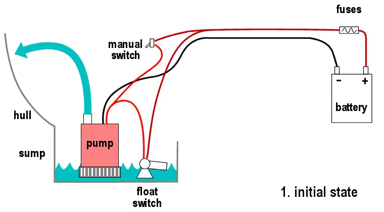
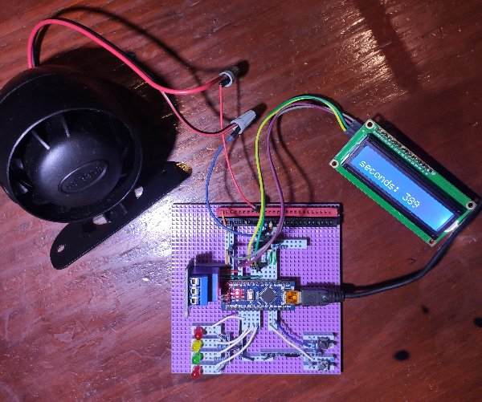
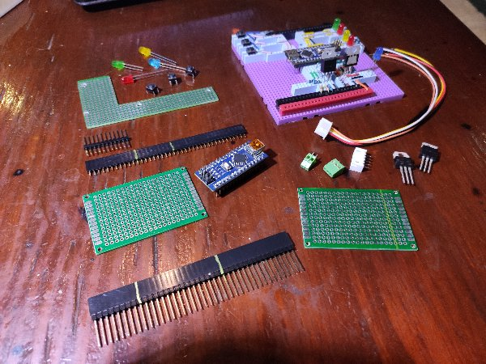
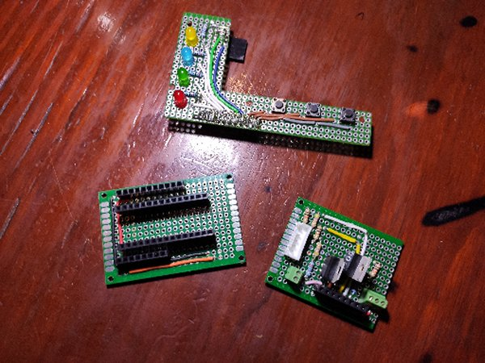
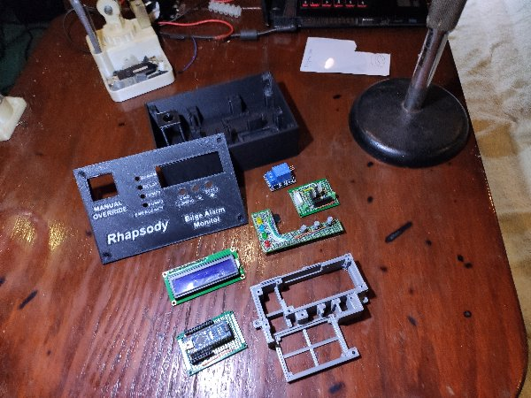
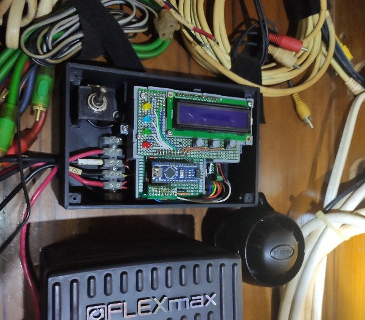
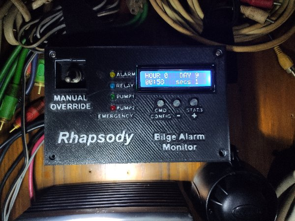

# bilgeAlarm - Previous

**[Home](readme.md)** --
**[History](history.md)** --
**Previous** --
**[Design](design.md)** --
**[Hardware](hardware.md)** --
**[Software](software.md)** --
**[UI](user_interface.md)**

### Bilge Changes

Before I introduce the *previous* Arduino based project, I would like to describe some
changes I made to the boat's bilge pump system before that, well before I got into
Arduino (embedded systems) programming.

When we got back to Bocas, the very first thing I did was add an **LED indicator**, mounted
in the salon, that would light up anytime the bilge pump ran.  They sell "12V" leds which
are just regular leds with small resistors soldered to them enclosed in heat shrink tubing,
so I drilled a hole and mounted one, in parallel with the pump, so that I could see
when the pump was running.

Not satisfied with that, I wanted to know if the bilge pump had run while I was not watching
the indicator, so I found a $25 **Bilge Pump Counter** device at *West Marine*, ordered it, and
added it, so that I could see a count of the number of times the pump had run since the last
reset.

Then, after some more thinking and reading, I found that the typical, and highly recommended
configuration was to mount a **2nd bilge pump** above the first one, so that in the event of a
failure of the 1st pump, or a more catastrophic ingress of water than it could handle, there
would be a second pump to handle the load.  It
was a non-trivial task to install the second bilge pump, due to the *confined space*, the
fact that it would be *under the batteries*, and the need for plumbing like *y-joints* and
*check valves*, so I did that sub-project coincident with *replacing all the batteries* on Rhapsody.

That solution sufficed for a year or so while I made other repairs to Rhapsody, but I
still wanted more.  I looked at the devices with audible alarms for sale for $50-150 at West Marine
and other chandleries, but really didn't like any of them.  Most of them use)
small *piezo electric buzzers* that are not really that load, and I wanted something that would
wake me up out of a dead sleep, and/or be heard outside the boat as well, in the case of a
serious ingress of water.

So I bought a $12 **car alarm** on Ebay and hooked it up in parallel to the 2nd bilge pump.

That solution was satisfactory for a number of years.  It went off, for example, one
time when the fuse on the 1st bilge pump corroded and didn't make good contact and
the water reached the 2nd pump, but I was always nagged by the fact
that the alarm itself drew about 2 amps, and that, in parallel with the 2nd pump, might
put to much load on the switch and/or weaken the pumps action due to the lost current.

Some years later I got into 3D printing, then started programming Arduinos, and one of the
earliest projects I undertook was to create a "device" using the Arduino to **monitor**
and control the bilge pumps.

I called it the **bilgePumpSwitch** project.

### Prototype

I prototyped the new device on a breadboard, testing my ability to use **mosfets** to
turn on (and "chirp") the alarm.   I used **voltage dividers** to *sense* the 12V from
the two float switches, without drawing very much current.

It is worth understanding that the bilge pump runs occasionally under normal circumstances.
As much as I try to make Rhapsody a **dry boat** where no water enters it, there is always
a bit of water entering the boat.  Some comes in through the *propeller shaft* (in spite
of the "dripless seal") and a bit of fresh water always gets into the boat via holes in the
*the mast* when it rains.

One thing I never liked about my particular bilge setup was that when the bilge pump
would run, which, as I said, happens fairly regularly, is that, due to the fact that
the exit for the water is 2-3 feet above the waterline, as well as 20 feet from the
bilge, at the rear of the boat, all the water that is in the hoses
that lead overboard wants to flow back into the bilge each time the pump runs and
turns off.

And due to the small **sump**, when the pump runs it usually only sends one or two cups of
water out. Usually when it runs, one of those two cups of water falls back into the
bilge, in spite of having **check valves** in the hoses. In addition, of course, as soon as the
float switch falls to a certain level, the pump turns off, and since the switch is
at the same level as the pump, it turns "off" when there is still an inch or so
of water in the bilge.

This, to me, meant that the bilge pump was running about twice as often as strictly
necessary, shortening it's service life.

So I decided to add a **relay**, that could turn the pump on via software control,
and that the device would be able to run the pump for a few additional seconds after
the float switch had fallen to make sure that as much water from the bilge was sent
overboard, and to give it time to push the water past the check valves.

### Parameterization and Alarms (Requirements)

The early device was designed to have an **LCD screen** for display, a number of
**push buttons** for configuration and control, and a number of **front panel LEDs**
in addition to a remote externally visable **indicator LED**.

I decided that it would be *parameter driven* and the user would be able to adjust
the parameters using the buttons.  I drew up an initial list of requirements,
starting with conditions under which the bilge pump would sound the alarm (and flash the
indicator leds) to notify me of an **alarm state**.  There would be alarms for the
following conditions:

- if the **2nd pump comes on** at all ... I also call it **the emergency pump**
- if the main bilge pump ran for **more than a certain number of seconds**
- if the main bilge pump ran **more than a certain number of times in an hour**
- if the main  bilge pump ran **more than a certain number of times in a day**

All of the above cases are things I want to know about **now**!!

In addition, the device would *incorporate the manual bilge pump switch* in parallel with
the relay, and be able to turn the pump on via the relay:

- there would be a way to turn the **relay on** via the buttons
- there would be a parameter for **the number of additional seconds** the pump would run whenever it came on
- there would be a parameter that would **run the primary pump if the 2nd ("emergency") pump came on**

This last case was specifically to account for the fact that the primary float switch might fail.  If
so, and if the emergency (2nd pump) comes on, the device would close the relay, turning the primary pump
on, and running it for some configurable number of seconds **after** the emergency pump stopped, to remove
the water in the "emergency zone".

Also, the device would keep some kind of **history** of the number of pump runs, in addition
to merely counting them, and be able to display that history,

Finally, there would be a way to **disable** and/or **turn off** the alarm(s) as I learned
very early that, althought the car alarm is great to notify you that something is wrong, it
is not very nice to be trying to find a problem in the bilge while the alarm is blaring.

All of these design requirements were carried over into the current bilgeAlarm project
and will be discussed in more detail in subsequent pages.

### Circuits, 3D Printing, and Mounting

Next: The overall **[design](design.md)** of the bilgeAlarm ...
