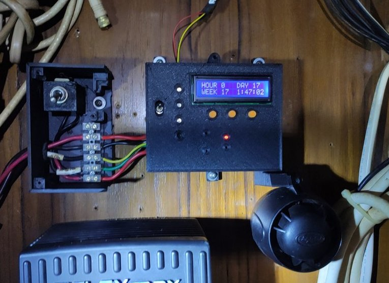

# bilgeAlarm - Home

**Home** --
**[History](history.md)** --
**[Previous](previous.md)** --
**[Design](design.md)** --
**[Hardware](hardware.md)** --
**[Software](software.md)** --
**[UI](user_interface.md)**

The **bilgeAlarm** is the most important device I have created for my boat,
[**Rhapsody**](http://www.phorton.com/html/Rhapsody.html). It is a device
for monitoring the bilge pump(s) on the boat, sounding a **loud alarm**
if the bilge pump runs too long, or too often.  It is the result of
[almost sinking Rhapsody](history.md) one time when the bilge pump ran,
but could not be heard, until it **burnt out** and the boat took on 1000's of
gallons of water, resulting in **serious damage** and a huge amount of repairs ...
and time and money ... to fix the problems caused by the flooding.

This bilgeAlarm uses an **ESP32** and is based on an
[earlier](previous.md) **Arduino** project, now lost to antiquity,
that I called the *bilgePumpSwitch*.
It uses the [**myIOT**](https://github.com/phorton1/Arduino-libraries-myIOT) library
for parametrization and to allow me to control and monitor it remotely.
It has an **SD Card** to keep prodigious amounts of history about the bilge pump,
and uses **WS3812b** leds for visual indicators, and a **very loud car alarm**,
that can be heard above the motor running and the sound of the boat when she is
underway and crashing through waves to ensure that **I know** if there is a problem
with water entering the boat.

On these pages I will document the [**design**](design.md) of the bilgeAlarm along with
how I created the [**hardware**](hardware.md) and [**software**](software.md) for
the device and provide a rudimentary [**user guide**](user_interface.md) for using it.

All of the **source code, schematics,** and **files** needed to create this
device can be found within the **docs** folder:

- **kicad** - the kicad *schematics* and *pcb* layouts and the **flatcam** project and gcode files to mill and create the PCBs
- **fusion** - the fusion 360 design files for the plastic box
- **stl** - the STL files that I used for 3D printing the box
- **prusa** - the Prusa slicer files and resultant gcode I used to print the box

## Required Libraries

To build this project, you will need to install the
[**myIOT library**](https://github.com/phorton1/Arduino-libraries-myIOT)
and it's dependencies.  Please see that project for details about **installation**
and building.

In addition, this project makes use of two standard libraries that can
be installed to the **Arduino IDE** using the *Tools - Library Manager*:

- Adafruit_neoPixels
- LiquidCrystal_I2C

## License

This program is free software: you can redistribute it and/or modify
it under the terms of the GNU General Public License Version 3 as published by
the Free Software Foundation.

This program is distributed in the hope that it will be useful,
but WITHOUT ANY WARRANTY; without even the implied warranty of
MERCHANTABILITY or FITNESS FOR A PARTICULAR PURPOSE.  See the
GNU General Public License for more details.

Please see [LICENSE.TXT](https://github.com/phorton1/Arduino-libraries-myIOT/blob/master/LICENSE.TXT) for more information.

Next: The **[story](history.md)** behind the bilgeAlarm ...
