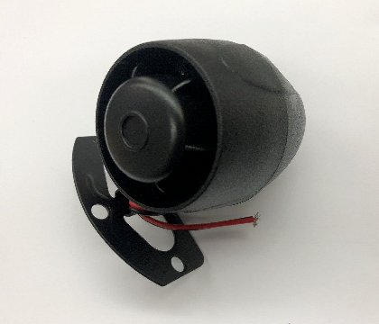

# bilgeAlarm - User Interface

**[Home](readme.md)** --
**[History](history.md)** --
**[Previous](previous.md)** --
**[Design](design.md)** --
**[Hardware](hardware.md)** --
**[Software](software.md)** --
**UI**

The bilgeAlarm is designed so that it can be completely configured
and controlled via three **pushbuttons** and the **lcd screen** built
into the device.  If your boat has a **wifi network** it can additionally
be connected to that wifi network to present a **WebUI** so that you
can monitor and control it from any web browser, as well as allowing
you to connect to it via **Telnet**.

It can be built with **MQTT** capabilities, so that you can control
and monitor it via **HomeAssistant** or **Mosquito/NodeRed** or any other
**IOT** (Internet of Things) architecture (if you use those on your boat)
for additional UI capabilities, and you can even attach it to things like
*Siri* or *Alexa* for voice control.

Finally there is an **as-yet-unpublished** project that uses a *Raspberry Pi*
to connect it, and any other [**myIOT**](https://github.com/phorton1/Arduino-libraries-myIOT)
device to to the **internet** so that you can monitor and control it
from anywhere in the world, over the internet.

In any case, regardless of how you monitor and control it, the **bilgeAlarm**
presents a **User Interface** that consists of a number of **parameters** that
you can see and set, as well as a variety of **indicators and alarms** that
will inform you if something untoward happens in your bilge.

## External Indicators - Alarm and LED

The bilgeAlarm provides two primary ways of notifying you that there is a problem.

The first is a very loud **car alarm** that will go off in an emergency, as well
as *chirp* for less serious situations.

There is also an **external LED** that
you mount someplace that is easily visible that will *light up and flash* different
colors depending on the situation.

The **car alarm** is connected directly to the bilgeAlarm during construction.
I have chosen to mount the **LED** in the salon of my boat where it can also
be seen from the helm.

Done! **[Back](readme.md)** to the beginning ...
